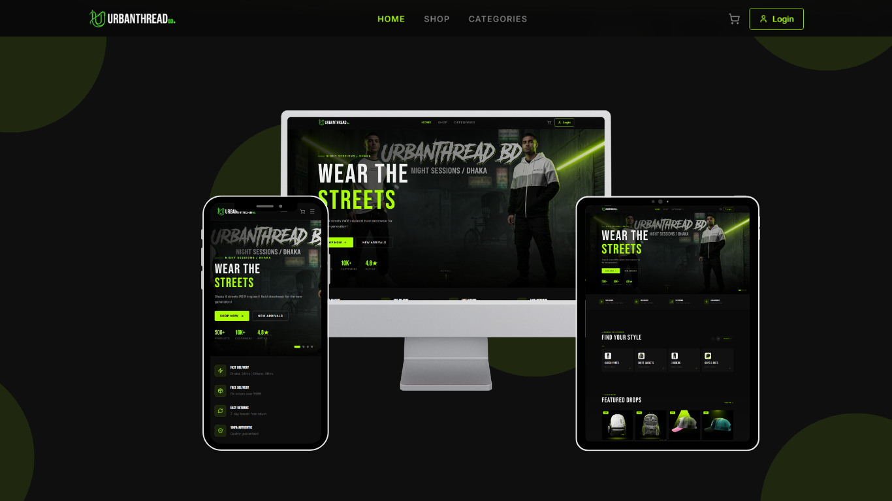

# UrbanThread BD — Premium Streetwear E-Commerce



<div align="center">

[](https://urbanthreadbd-fe293.web.app/)
[](https://urbanthreadbd-backend.vercel.app/)
[](https://github.com/NaeemMajumder/urbanthreadbd_server)
[](https://github.com/NaeemMajumder/urbanthreadbd_client)
[](https://reactjs.org/)
[](https://nodejs.org/)
[](https://mongodb.com/atlas)

**Dhaka র streets থেকে inspired। Bold streetwear for the new generation।**

[🌐 Live Site](https://urbanthreadbd-fe293.web.app/) • [🔗 API](https://urbanthreadbd-backend.vercel.app/) • [📦 Backend Repo](https://github.com/NaeemMajumder/urbanthreadbd_server)

</div>

---

## 📋 Table of Contents

- [Overview](#-overview)
- [Features](#-features)
- [Tech Stack](#-tech-stack)
- [Project Structure](#-project-structure)
- [Getting Started](#-getting-started)
- [Environment Variables](#-environment-variables)
- [Demo Credentials](#-demo-credentials)
- [API Reference](#-api-reference)
- [Pages & Routes](#-pages--routes)
- [Screenshots](#-screenshots)
- [Deployment](#-deployment)
- [Author](#-author)

---

## 🎯 Overview

**UrbanThread BD** is a full-stack MERN e-commerce platform built as a portfolio demo for **Oxivos Agency** — a web development agency specializing in clothing & fashion e-commerce for Bangladeshi small businesses.

This project demonstrates a complete, production-ready e-commerce solution including:
- Full authentication flow with role-based access
- Product browsing with advanced filtering, sorting & search
- Cart system with guest & authenticated user support
- Checkout with COD & bKash mock payment
- User dashboard with order history
- Full admin panel for managing the entire store

> **Note:** This is a portfolio demo project. For production use, additional security measures, real payment gateway integration, and performance optimizations are required.

---

## ✨ Features

### 🛍️ Customer Features
- **Authentication** — Register & Login with phone number + password
- **Product Browsing** — Filter by category, size, price range | Sort by price & name | Search
- **Product Detail** — Image gallery, size/color selector, stock status
- **Reviews** — Create, edit & delete product reviews (delivered orders only)
- **Cart** — Add/remove/update items | Guest cart merges on login
- **Checkout** — Delivery form, COD & bKash mock payment
- **Order History** — View all orders with expandable item details
- **Profile Management** — Edit name, phone, email | Change password

### 🛡️ Admin Features
- **Dashboard** — Real-time stats (orders, revenue, products, today's orders)
- **Products CRUD** — Add/edit/delete products with image gallery, sizes, colors, featured toggle
- **Categories CRUD** — Parent/child category management with image support
- **Orders Management** — View all orders, update status (Pending → Processing → Shipped → Delivered)
- **Users Management** — View all users with order history per user

---

## 🛠️ Tech Stack

### Frontend
| Technology | Purpose |
|---|---|
| **React 18** | UI Framework |
| **Vite** | Build Tool |
| **React Router v6** | Client-side Routing |
| **Axios** | HTTP Client |
| **React Hot Toast** | Notifications |
| **Lucide React** | Icons |
| **Context API** | Global State (Auth + Cart) |

### Backend
| Technology | Purpose |
|---|---|
| **Node.js + Express** | Server & REST API |
| **MongoDB + Mongoose** | Database & ODM |
| **JWT** | Authentication |
| **bcrypt** | Password Hashing |
| **CORS** | Cross-Origin Resource Sharing |

### DevOps & Deployment
| Service | Purpose |
|---|---|
| **Firebase Hosting** | Frontend Deployment |
| **Vercel** | Backend Deployment |
| **MongoDB Atlas** | Cloud Database |
| **GitHub** | Version Control |

---

## 📁 Project Structure

```
urbanthreadbd_frontend/
├── public/
│   └── favicon.ico
│
├── src/
│   ├── api/                        # API service layer
│   │   ├── axios.js                # Base config + interceptors
│   │   ├── auth.api.js             # Auth endpoints
│   │   ├── product.api.js          # Product endpoints
│   │   ├── category.api.js         # Category endpoints
│   │   ├── cart.api.js             # Cart endpoints
│   │   ├── order.api.js            # Order endpoints
│   │   ├── review.api.js           # Review endpoints
│   │   └── user.api.js             # User endpoints
│   │
│   ├── context/                    # Global state management
│   │   ├── AuthContext.jsx         # User auth state
│   │   └── CartContext.jsx         # Cart state + backend sync
│   │
│   ├── hooks/                      # Custom React hooks
│   │   ├── useAuth.js              # Auth context hook
│   │   └── useCart.js              # Cart context hook
│   │
│   ├── routes/                     # Route definitions
│   │   ├── AppRoutes.jsx           # All routes
│   │   ├── ProtectedRoute.jsx      # Auth guard
│   │   └── AdminRoute.jsx          # Admin guard
│   │
│   ├── components/
│   │   ├── common/
│   │   │   └── ScrollToTop.jsx     # Scroll to top on route change
│   │   └── layout/
│   │       ├── Navbar.jsx          # Navigation bar
│   │       ├── Footer.jsx          # Footer
│   │       └── MainLayout.jsx      # Layout wrapper
│   │
│   ├── pages/
│   │   ├── HomePage.jsx            # Hero banner, categories, featured products
│   │   ├── ProductsPage.jsx        # Product listing with filters
│   │   ├── ProductDetailPage.jsx   # Product detail + reviews
│   │   ├── CartPage.jsx            # Shopping cart
│   │   ├── CheckoutPage.jsx        # Order checkout
│   │   ├── LoginPage.jsx           # User login
│   │   ├── RegisterPage.jsx        # User registration
│   │   ├── CategoriesPage.jsx      # All categories
│   │   ├── DashboardPage.jsx       # User dashboard
│   │   └── admin/
│   │       └── AdminPage.jsx       # Admin panel
│   │
│   ├── assets/                     # Static assets
│   │   ├── logo-dark.png
│   │   └── logo-light.png
│   │
│   ├── App.jsx                     # Root component + providers
│   ├── main.jsx                    # Entry point
│   └── index.css                   # Global styles
│
├── .env                            # Environment variables
├── .gitignore
├── vite.config.js
├── package.json
└── README.md
```

---

## 🚀 Getting Started

### Prerequisites
- Node.js `v18+`
- npm `v9+`
- Backend server running (see [Backend Repo](https://github.com/NaeemMajumder/urbanthreadbd_server))

### Installation

**1. Clone the repository**
```bash
git clone https://github.com/YOUR_USERNAME/urbanthreadbd_frontend.git
cd urbanthreadbd_frontend
```

**2. Install dependencies**
```bash
npm install
```

**3. Set up environment variables**
```bash
cp .env.example .env
# Edit .env with your values
```

**4. Start development server**
```bash
npm run dev
```

The app will be running at `http://localhost:5173`

### Build for Production
```bash
npm run build
npm run preview  # preview production build locally
```

---

## 🔐 Environment Variables

Create a `.env` file in the root directory:

```env
# Backend API URL
VITE_API_URL=http://localhost:5000/api/v1
```

For production deployment:
```env
VITE_API_URL=https://urbanthreadbd-backend.vercel.app/api/v1
```

---

## 👤 Demo Credentials

> Use these credentials to explore the application without creating an account.

### 🛡️ Admin Account
```
Phone    : +8801712345678
Password : rahim1234
Role     : Admin
Access   : Full admin panel + all customer features
```

### 👤 User Account
```
Phone    : 01433233232
Password : helloworld
Role     : User
Access   : Customer features (cart, checkout, orders, reviews)
```

---

## 🔗 API Reference

**Base URL:** `https://urbanthreadbd-backend.vercel.app/api/v1`

### Authentication
| Method | Endpoint | Description | Auth Required |
|--------|----------|-------------|---------------|
| `POST` | `/auth/register` | Register new user | No |
| `POST` | `/auth/login` | Login user | No |
| `POST` | `/auth/logout` | Logout user | Yes |

### Products
| Method | Endpoint | Description | Auth Required |
|--------|----------|-------------|---------------|
| `GET` | `/products` | Get all products (with filters) | No |
| `GET` | `/products/:id` | Get single product | No |
| `POST` | `/products` | Create product | Admin |
| `PATCH` | `/products/:id` | Update product | Admin |
| `DELETE` | `/products/:id` | Delete product | Admin |

**Query Parameters for GET /products:**
```
?page=1&limit=10
&category=slug-or-id
&search=keyword
&size=M,L
&minPrice=500&maxPrice=3000
&featured=true
&sort=price_asc|price_desc|name_asc
```

### Categories
| Method | Endpoint | Description | Auth Required |
|--------|----------|-------------|---------------|
| `GET` | `/categories` | Get all categories | No |
| `GET` | `/categories/:id` | Get single category | No |
| `POST` | `/categories` | Create category | Admin |
| `PATCH` | `/categories/:id` | Update category | Admin |
| `DELETE` | `/categories/:id` | Delete category | Admin |

### Cart
| Method | Endpoint | Description | Auth Required |
|--------|----------|-------------|---------------|
| `GET` | `/cart` | Get user's cart | Yes |
| `POST` | `/cart` | Add item to cart | Yes |
| `PATCH` | `/cart/:productId` | Update cart item | Yes |
| `DELETE` | `/cart/:productId` | Remove cart item | Yes |
| `DELETE` | `/cart` | Clear entire cart | Yes |

### Orders
| Method | Endpoint | Description | Auth Required |
|--------|----------|-------------|---------------|
| `POST` | `/orders` | Create order | Yes |
| `GET` | `/orders/my-orders` | Get user's orders | Yes |
| `GET` | `/orders` | Get all orders | Admin |
| `PATCH` | `/orders/:id/status` | Update order status | Admin |

### Reviews
| Method | Endpoint | Description | Auth Required |
|--------|----------|-------------|---------------|
| `GET` | `/reviews/:productId` | Get product reviews | No |
| `POST` | `/reviews/:productId` | Create review | Yes (Delivered order) |
| `PATCH` | `/reviews/:id` | Update review | Yes (Own review) |
| `DELETE` | `/reviews/:id` | Delete review | Yes (Own review) |

### Users
| Method | Endpoint | Description | Auth Required |
|--------|----------|-------------|---------------|
| `GET` | `/users/me` | Get current user | Yes |
| `PATCH` | `/users/me` | Update current user | Yes |
| `GET` | `/users` | Get all users | Admin |
| `GET` | `/users/:id` | Get user by ID | Admin |

---

## 📄 Pages & Routes

| Route | Page | Access |
|-------|------|--------|
| `/` | HomePage | Public |
| `/products` | Products Listing | Public |
| `/products/:id` | Product Detail | Public |
| `/categories` | Categories | Public |
| `/cart` | Shopping Cart | Public |
| `/login` | Login | Public (redirect if logged in) |
| `/register` | Register | Public (redirect if logged in) |
| `/checkout` | Checkout | Protected (login required) |
| `/dashboard` | User Dashboard | Protected |
| `/admin` | Admin Panel | Admin only |

---

## 📸 Screenshots

> The application is fully responsive across all devices.

| Desktop | Tablet | Mobile |
|---------|--------|--------|
| Full navigation with dropdown | Adapted layout | Hamburger menu |
| Full product grid | 2-column grid | Single column |
| Side-by-side product detail | Stacked layout | Stacked layout |

---

## 🚀 Deployment

### Frontend (Firebase Hosting)

```bash
# Install Firebase CLI
npm install -g firebase-tools

# Login to Firebase
firebase login

# Initialize Firebase (first time)
firebase init hosting

# Build the project
npm run build

# Deploy
firebase deploy
```

**Live URL:** [https://urbanthreadbd-fe293.web.app/](https://urbanthreadbd-fe293.web.app/)

### Backend (Vercel)

```bash
# Install Vercel CLI
npm install -g vercel

# Deploy
vercel --prod
```

**API URL:** [https://urbanthreadbd-backend.vercel.app/](https://urbanthreadbd-backend.vercel.app/)

### Environment Setup for Production

**Vercel Backend Environment Variables:**
```
MONGODB_URI     = mongodb+srv://...
JWT_SECRET      = your_secret_key
JWT_EXPIRES_IN  = 7d
NODE_ENV        = production
CORS_ORIGINS    = https://urbanthreadbd-fe293.web.app
```

---

## 🎨 Design System

### Color Palette
| Color | Hex | Usage |
|-------|-----|-------|
| Background | `#0A0A0A` | Page background |
| Surface | `#111111` | Cards, panels |
| Primary | `#AAFF00` | CTAs, highlights |
| Text Primary | `#F0F0F0` | Main text |
| Text Muted | `#555555` | Secondary text |
| Success | `#AAFF00` | Delivered status |
| Warning | `#FF8800` | Processing status |
| Info | `#00AAFF` | Shipped status |
| Error | `#FF4444` | Error, delete |

### Typography
- **Headings:** Bebas Neue (Google Fonts)
- **Body:** Inter (Google Fonts)
- **Code/IDs:** Courier New (System)

---

## 📦 Key Dependencies

```json
{
  "react": "^18.x",
  "react-dom": "^18.x",
  "react-router-dom": "^6.x",
  "axios": "^1.x",
  "react-hot-toast": "^2.x",
  "lucide-react": "^0.x"
}
```

---

## ⚠️ Known Limitations (Demo Version)

This is a **portfolio demo** — the following are intentional simplifications:

- 🔐 Token stored in `localStorage` (Production: use `httpOnly` cookies)
- 💳 bKash payment is mocked (Production: use real SSLCommerz/bKash API)
- 🖼️ Image upload via URL (Production: use Cloudinary file upload)
- 📧 No email notifications (Production: use NodeMailer/SendGrid)
- 🔄 No refresh token (Production: implement refresh token rotation)

---

## 👨‍💻 Author

**Naeem Majumder**

- 🎓 BSc Computer Science — American International University Bangladesh (AIUB)
- 💼 Developer — [Oxivos Agency](https://oxivos.com) *(Web Development Agency)*
- 🌐 Specialization — MERN Stack, E-Commerce for Bangladeshi Fashion Brands
- 📍 Location — Dhaka, Bangladesh

---

## 📄 License

This project is built by **Naeem Majumder** for **Oxivos Agency** portfolio.
© 2025 Oxivos. All rights reserved.

---

<div align="center">

**Built with ❤️ in Dhaka, Bangladesh**

*Dhaka-born. Street-built. Worn by those who move.*

[](https://urbanthreadbd-fe293.web.app/)

</div>